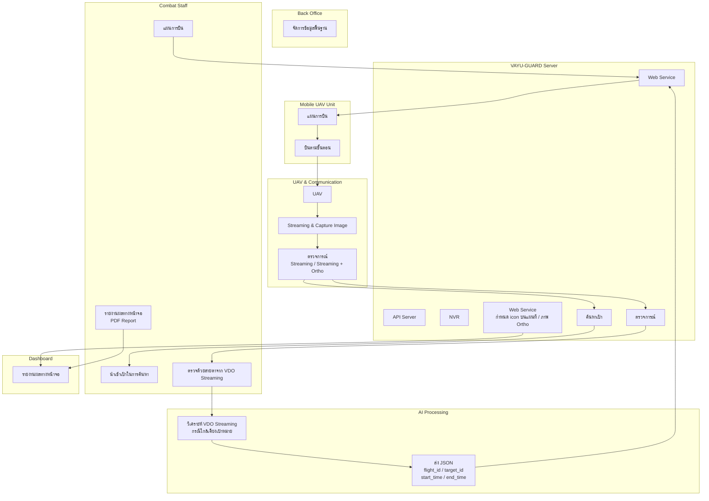

# Flow #2 - Process / Data Flow Diagram

แสดงขั้นตอนการทำงานและการไหลของข้อมูล (ข้อมูลไหลอย่างไร)



## สรุป

- **ประเภท**: Process / Data Flow Diagram
- **จุดเน้น**: ขั้นตอนการทำงานและการไหลของข้อมูล
- **มุมมอง**: "ข้อมูลไหลอย่างไร"

### Data Flow หลัก

1. **Combat Staff** สร้างแผนการบิน → Web Service
2. **Web Service** ส่งแผนไปยัง Mobile UAV Unit
3. **Mobile UAV Unit** บินอัตโนมัติตามแผน
4. **UAV** ทำการ Streaming & Capture Image
5. **ตรวจการณ์** แยกเป็น 2 โหมด: ค้นหาเป้า / ตรวจการณ์
6. **AI Processing** วิเคราะห์ VDO และส่ง JSON กลับ
7. **Dashboard** แสดงรายงานผล

### JSON Output จาก AI
```json
{
  "flight_id": "...",
  "target_id": "...",
  "start_time": "...",
  "end_time": "..."
}
```
